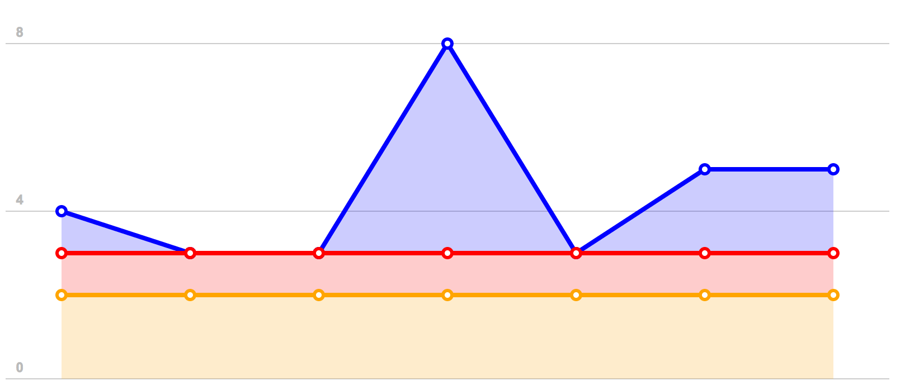

Crumble Factory
==============

This is a simple javascript library to draw crumbles in the web. Depends on
[Raphael](https://github.com/DmitryBaranovskiy/raphael/) which uses the SVG W3C Recommendation and VML as a base for creating graphics.

